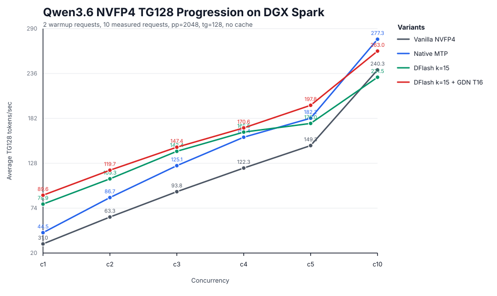

# Qwen3.6 NVFP4 TG128 Progression Sweep

Run ID: `qwen36_progression_20260513T152918Z`

Benchmark shape: `pp=2048`, `tg=128`, `depth=0`, no cache, generation latency.
Each cell uses 2 explicit warmup requests and 10 measured requests. llama-benchy internal warmup, coherence check, and prompt adaptation were disabled for this sweep.



## Throughput Matrix

Each value is the mean TPS of 10 measured TG128 requests at that concurrency.
The columns are separate operating points and should not be averaged together.

| Variant | c1 | c2 | c3 | c4 | c5 | c10 |
| --- | ---: | ---: | ---: | ---: | ---: | ---: |
| Vanilla NVFP4 | 30.99 | 63.31 | 93.84 | 122.26 | 149.28 | 240.34 |
| Native MTP | 44.52 | 86.74 | 125.12 | 159.37 | 182.23 | 277.26 |
| DFlash k=15 | 78.91 | 109.28 | 142.44 | 165.51 | 175.99 | 231.54 |
| DFlash k=15 + GDN T16 | 89.60 | 119.66 | 147.36 | 170.57 | 197.82 | 262.97 |

## Gain Versus Vanilla

| Variant | c1 | c2 | c3 | c4 | c5 | c10 |
| --- | ---: | ---: | ---: | ---: | ---: | ---: |
| Vanilla NVFP4 | +0.00 tok/s (+0.0%) | +0.00 tok/s (+0.0%) | +0.00 tok/s (+0.0%) | +0.00 tok/s (+0.0%) | +0.00 tok/s (+0.0%) | +0.00 tok/s (+0.0%) |
| Native MTP | +13.53 tok/s (+43.7%) | +23.43 tok/s (+37.0%) | +31.29 tok/s (+33.3%) | +37.12 tok/s (+30.4%) | +32.94 tok/s (+22.1%) | +36.92 tok/s (+15.4%) |
| DFlash k=15 | +47.92 tok/s (+154.6%) | +45.97 tok/s (+72.6%) | +48.60 tok/s (+51.8%) | +43.25 tok/s (+35.4%) | +26.71 tok/s (+17.9%) | -8.80 tok/s (-3.7%) |
| DFlash k=15 + GDN T16 | +58.60 tok/s (+189.1%) | +56.35 tok/s (+89.0%) | +53.52 tok/s (+57.0%) | +48.31 tok/s (+39.5%) | +48.54 tok/s (+32.5%) | +22.63 tok/s (+9.4%) |

## c1 Comparisons

| Variant | Mean TG128 TPS | Attributed comparison | Delta tok/s | Delta % | Notes |
| --- | ---: | --- | ---: | ---: | --- |
| Vanilla NVFP4 | 30.99 | Baseline | baseline | baseline | Target model only, no speculative decoding. |
| Native MTP | 44.52 | MTP recipe vs vanilla | +13.53 tok/s | +43.7% | Native MTP speculation with num_speculative_tokens=1. |
| DFlash k=15 | 78.91 | DFlash recipe vs vanilla | +47.92 tok/s | +154.6% | DFlash draft model with num_speculative_tokens=15; alternative to MTP. |
| DFlash k=15 + GDN T16 | 89.60 | GDN T16 bundle vs DFlash k=15 | +10.69 tok/s | +13.5% | Same DFlash k=15 recipe plus fp16 GDN SSM cache and the Qwen GDN T16 commit1 unpaired Triton verifier path. |
| DFlash k=15 + GDN T16 | 89.60 | Final recipe vs vanilla | +58.60 tok/s | +189.1% | End-to-end optimized recipe versus target-only NVFP4. |

## Optimized Activation Evidence

The optimized path was reloaded after the sweep for a one-request activation
check. The captured server log contains:

```text
Qwen GDN T16 commit1 unpaired Triton path active: rows=16 accepted=16 state_dtype=torch.float16
```

Evidence files:

| File | Purpose |
| --- | --- |
| `optimized_activation_check.log` | Server log containing the activation line. |
| `activation_check_tg128.json` | One-request decode used only to trigger the activation log; not included in the throughput matrix. |

## Raw Result Files

| Variant | Concurrency | Runs | File |
| --- | ---: | ---: | --- |
| Vanilla NVFP4 | 1 | 10 | `raw/vanilla_nvfp4_c1_tg128.json` |
| Vanilla NVFP4 | 2 | 10 | `raw/vanilla_nvfp4_c2_tg128.json` |
| Vanilla NVFP4 | 3 | 10 | `raw/vanilla_nvfp4_c3_tg128.json` |
| Vanilla NVFP4 | 4 | 10 | `raw/vanilla_nvfp4_c4_tg128.json` |
| Vanilla NVFP4 | 5 | 10 | `raw/vanilla_nvfp4_c5_tg128.json` |
| Vanilla NVFP4 | 10 | 10 | `raw/vanilla_nvfp4_c10_tg128.json` |
| Native MTP | 1 | 10 | `raw/mtp_nvfp4_c1_tg128.json` |
| Native MTP | 2 | 10 | `raw/mtp_nvfp4_c2_tg128.json` |
| Native MTP | 3 | 10 | `raw/mtp_nvfp4_c3_tg128.json` |
| Native MTP | 4 | 10 | `raw/mtp_nvfp4_c4_tg128.json` |
| Native MTP | 5 | 10 | `raw/mtp_nvfp4_c5_tg128.json` |
| Native MTP | 10 | 10 | `raw/mtp_nvfp4_c10_tg128.json` |
| DFlash k=15 | 1 | 10 | `raw/dflash_nvfp4_c1_tg128.json` |
| DFlash k=15 | 2 | 10 | `raw/dflash_nvfp4_c2_tg128.json` |
| DFlash k=15 | 3 | 10 | `raw/dflash_nvfp4_c3_tg128.json` |
| DFlash k=15 | 4 | 10 | `raw/dflash_nvfp4_c4_tg128.json` |
| DFlash k=15 | 5 | 10 | `raw/dflash_nvfp4_c5_tg128.json` |
| DFlash k=15 | 10 | 10 | `raw/dflash_nvfp4_c10_tg128.json` |
| DFlash k=15 + GDN T16 | 1 | 10 | `raw/optimized_nvfp4_c1_tg128.json` |
| DFlash k=15 + GDN T16 | 2 | 10 | `raw/optimized_nvfp4_c2_tg128.json` |
| DFlash k=15 + GDN T16 | 3 | 10 | `raw/optimized_nvfp4_c3_tg128.json` |
| DFlash k=15 + GDN T16 | 4 | 10 | `raw/optimized_nvfp4_c4_tg128.json` |
| DFlash k=15 + GDN T16 | 5 | 10 | `raw/optimized_nvfp4_c5_tg128.json` |
| DFlash k=15 + GDN T16 | 10 | 10 | `raw/optimized_nvfp4_c10_tg128.json` |
